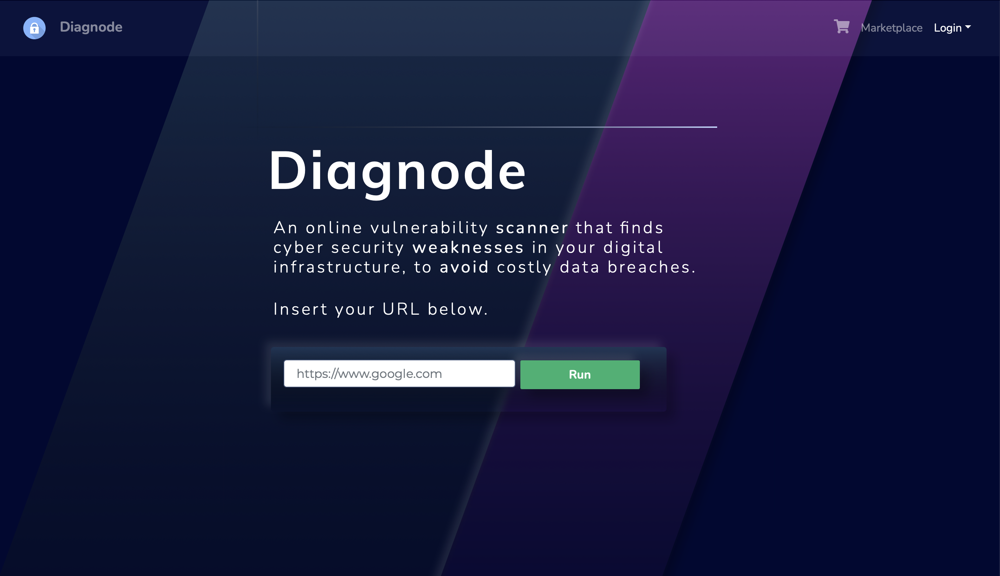

# Project - Diagnode CyberSecurity Marketplace

### View in browser
[Live](http://www.diagnode.co.uk/)

### Screenshot

## Built With

- HTML
- CSS
- Ruby on Rails
- Ruby
- GSAP
- JavaScript

## Authors

👤 **Marcus**

- GitHub: [@marcusal](https://github.com/marcusal)

## Description

Diagnode is an affiliate based e-commerce web app. It evaluates the users network, and creates a tailored list of cybersecurity experts that can help provide them with optimised network security. 

## Getting Started

- First create an account or login
- Now enter the url of the website you wish to check for security flaws
- You will be taken to an index page which shows the results of your search, and any known issues
- Your search is automatically saved to the system, available to access at any time
- Visit the marketplace to see a collection of experts/companies who can help you fix your website
- Hire any number of experts, and checkout, and pay. Your basket is saved and ready to access at any time. Even if you logout, or switch user

## Prequisites

An internet browser, and a desktop PC or Mac

## Usage

This website can be ran multiple times, and you can sign up any number of times

## Deployment

Use a local broswer to deploy the project for testing

## Contributing

Contributions, issues, and feature requests are welcome!

Feel free to check the [issues page](https://github.com/marcusal/sakoiwebsite/issues)

## 📝 License

This project is [MIT](LICENSE) licensed.
